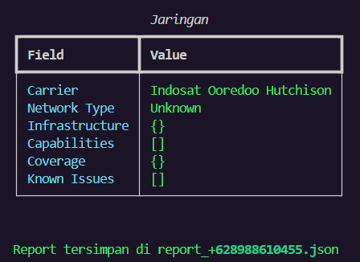

<div align="center">

# 📱 PhoneDetective
### Powerful Phone Number OSINT Tool

[Features](#features) • [Installation](#installation) • [Usage](#usage) • [Examples](#examples) • [Contributing](#contributing)


 
 
 

</div>

---

## 🔍 Tentang PhoneDetective

PhoneDetective adalah alat OSINT (Open Source Intelligence) yang dirancang untuk mengungkap informasi tersembunyi di balik nomor telepon secara sederhana. Dengan antarmuka yang intuitif, PhoneDetective membantu kamu untuk mengumpulkan intelligence dari berbagai sumber terbuka.

## ✨ Fitur Unggulan

🔹 **Validasi**
- Deteksi format nomor telepon otomatis
- Validasi real time untuk memastikan akurasi
- Format Nasional (Indonesia)

🔹 **Analisis**
- Identifikasi provider seluler
- Deteksi lokasi geografis
- Riwayat registrasi nomor

🔹 **Laporan**
- Export hasil dalam format JSON
- Visualisasi data interaktif
- Ringkasan analisis terstruktur

## 🚀 Cara Mulai

### Prasyarat
- Python 3.6+
- pip (Python package installer)
- Internet connection

### Instalasi Cepat

```bash
# Clone repository
https://github.com/rexzea/PhoneDetective.git

# Pindah ke direktori
cd PhoneDetective

# Install dependensi
pip install -r requirements.txt
```

## 💡 Penggunaan

### 1. Run with Python terminal

### 2.  Mode Interaktif
```python
              Informasi Dasar
┏━━━━━━━━━━━━━━━━━━━━━━┳━━━━━━━━━━━━━━━━━━┓
┃ Field                ┃ Value            ┃
┡━━━━━━━━━━━━━━━━━━━━━━╇━━━━━━━━━━━━━━━━━━┩
│ Format Internasional │ +62 898-8610-455 │
│ Format Nasional      │ 0898-8610-455    │
│ Format E164          │ +628988610455    │
│ Kode Negara          │ +62              │
│ Nomor Nasional       │ 8988610455       │
│ Tipe                 │ 1                │
│ Valid                │ True             │
│ Kemungkinan          │ True             │
└──────────────────────┴──────────────────┘
```

### 3.  📊 Contoh Output (JSON)

```json
{
  "number": "+62812XXXXX",
  "valid": true,
  "provider": "Telkomsel",
  "location": {
    "province": "DKI Jakarta",
    "region": "Indonesia"
  },
  "risk_score": 0.2,
  "last_seen": "2024-12-15"
}
```

## 🤝 Kontribusi

Kami sangat menghargai kontribusi kamu! Berikut cara kamu bisa membantu:

1. 🍴 Fork repository ini
2. 🌿 Buat branch fitur (`git checkout -b fitur-baru`)
3. 💫 Commit perubahan (`git commit -m 'Menambah fitur baru'`)
4. 🚀 Push ke branch (`git push origin fitur-baru`)
5. 🎉 Buat Pull Request

## 📜 Lisensi

Project ini dilisensikan di bawah MIT License - lihat file [LICENSE](LICENSE) untuk detail.

## 🌟 Dukungan

Suka dengan PhoneDetective? Berikan ⭐️ di GitHub!

---

<div align="center">
Dibuat dengan ❤️ oleh [Rexzea]

[Report Bug](https://github.com/rexzea/PhoneDetective/issues) • [Request Feature](https://github.com/rexzea/PhoneDetective/issues)
</div>
